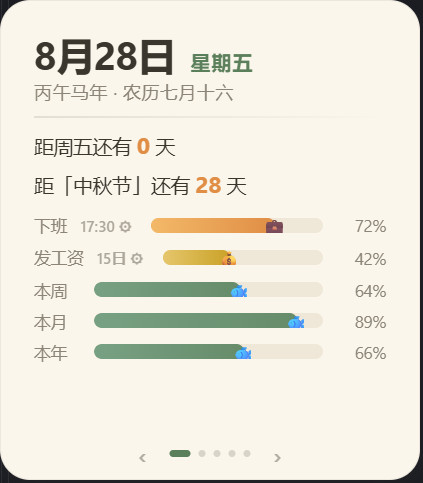
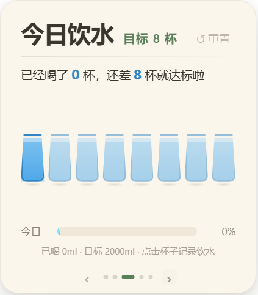

# 摸鱼小组件 · Windows 桌面置顶小组件

无边框、置顶、可拖动的 Windows 桌面小组件。鼠标横向滑动翻页，五个页面：

- **日历** — 今天的日期、农历干支纪年、距周五和下个法定节假日还有几天；5 条鱼缸进度条：`下班`（橙色 💼）→ `发工资`（金色 💰）→ `本周` / `本月` / `本年`（绿色 🐟）
- **牛马黄历** — 打工人每日一签：2 宜 2 忌（成对互文）、今日宜饮、工位朝向、牛马指数和一句签文；按日期种子本地算出，同一天固定，跨天自动换签
- **饮水** — 8 杯目标，按天自动重置；可视化杯子进度条
- **扭蛋** — 午饭扭蛋机，自定义选项库，spin / manage 两视图
- **每日一言** — 调 [Hitokoto 一言网](https://hitokoto.cn/) 的诗词/文学短句，**点击句子本身**换一句；网络挂了走兜底例句，按日期缓存当天一句

暖白卡片 + 抹茶绿 / 杏橙点缀；离线可用（节假日内置），运行时只在一言页拉一次 API。

<p>
  
  
  
  
  
</p>

## 1. 安装依赖

```powershell
npm install
```

## 2. 本地开发（带热重载）

```powershell
npm run dev
```

会同时启动 Vite 开发服务器和 Electron 窗口，改代码会自动刷新。

## 3. 打包成 Windows 安装包

```powershell
npm run build
```

产物在 `release/` 目录下，是一个 NSIS 安装包（`.exe`），双击安装后即可在开始菜单里找到"摸鱼小组件"。也可以只运行 `npm run build:renderer` 生成网页产物，自己用别的方式打包。

只跑类型检查：`npm run typecheck`。

## 4. 使用方式

- **拖动窗口**：左键按住卡片**顶部 10px 边缘**即可拖动（这块是 Electron 的 drag region），位置会自动保存，下次打开还在原处；换显示器或改分辨率后如果保存的位置跑到屏幕外，会自动回退到默认位置
- **横向滑动翻页**：在卡片内**左键按住横向拖动 40px 以上**，或在**触控板上双指横向扫**，即可在 5 页之间循环切换（向右拖 = 上一页，向左拖 = 下一页）
- **点底部指示器翻页**：底部中央有 5 个小圆点 + 左右箭头，当前页对应的点会变成长条；点箭头可翻页，点对应的小点也可直接跳到该页
- **右键菜单**：可以切换「始终置顶」「开机自启动」，或者「退出」；重复启动只会唤起已有窗口（单实例）

## 5. 页面说明

### 日历页（默认 / 第 1 页）

- 当前日期（大号数字标题）+ 星期
- 农历、干支纪年
- 距周五还有几天 / 距下一个法定节假日还有几天
- 5 条鱼缸进度条（顺序固定）：
  - `下班` 💼（橙色，可编辑默认 `17:30`，点击 `⚙` 改时间）
  - `发工资` 💰（金色，可编辑每月几日，默认 `15`）
  - `本周` / `本月` / `本年` 🐟（绿色）

### 牛马黄历页（第 2 页）

- 打工人专属每日一签：**2 宜 2 忌**（成对互文，比如「宜 甩锅 / 忌 背锅」）+ 今日宜饮 + 工位朝向 + 牛马指数（★1–5）+ 底部签文
- 词库内置：30 组宜忌、10 种宜饮、10 种朝向、14 句签文，全部原创牛马梗
- 实现是**日期种子伪随机**（FNV hash + mulberry32）：同一天多次打开结果完全一致，跨天自动换签；纯本地计算，零网络请求
- 参考了 [programmer-calendar](https://github.com/leizongmin/programmer-calendar) 的宜忌配对结构，文案为原创

### 饮水页（第 3 页）

- 8 个杯子按钮横排，点击满杯（蓝色脉冲的那个）记录一次饮水，喝掉后杯子变空
- 点击刚喝的那一杯可以撤销
- 标题行右侧 `↺ 重置` 按钮手动归零；tag 在「目标 N 杯」和「已达标 🎉」之间切换
- 每天自动重置：写入时带 `YYYY-M-D` 日期戳；切回前台时再读 storage；启动时排个 `setTimeout` 到本地 `00:00:01` 主动清零

### 扭蛋页（第 4 页）

- 默认 spin 视图：大结果窗口（显示扭到的饭）+ 圆形橙色按钮
- 点击"扭一下"会循环 18 步逐渐减速，最后落在随机一个选项；选项 ≥ 2 个时尽量避免连续两次同结果
- 点击右上角「✎ 管理」切换到 manage 视图：chip 列表（点 × 删除，至少保留 1 个）+ 输入框添加新选项
- 自定义选项也存 localStorage，初值有 9 个种子饭

### 每日一言页（第 5 页）

- 标题「每日一言 · 文学 · 诗词」+ 副标题「来自一言网 · 点击句子换一句」
- 主体是 Hitokoto 短句，按中文标点 `，。？；！？` **自动分行**展示，更符合诗词节奏
- **点击句子本身**换一句：6 秒超时 fallback 到本地 6 句经典诗词（陆游/李白/杜甫/屈原/周易）
- 今天的句子会按日期缓存到 `localStorage`（key `moyu-quote-of-day`），第二天打开自动重新拉
- 「—— 出处《篇目》」署名在句子下方，底部 caption 显示「已经换了 N 句」/「网络不给力，先看本地例句」等状态

## 6. 更新下一年节假日数据

每年 11 月前后，国务院办公厅会发布下一年度的节假日安排。用 `fetch-holidays` 从 timor.tech 拉对应年份的数据，把输出的两段 TS 代码粘贴进 `src/lib/holidays.ts` 对应的两个数组即可，不需要改任何计算逻辑（`workday.ts` 是纯根据这两份数据算的）。**只有手动跑这条命令时会联网**，小组件运行时不会发任何节假日相关的网络请求。

```powershell
npm run fetch-holidays -- 2027
```

输出（每行末尾的 `// 五–日` / `// 一` 是工具自动算的星期，对照原文能一眼看出有没有解析错）：

```ts
HOLIDAY_PERIODS 追加：
  { name: '元旦', start: '2027-01-01', end: '2027-01-03' }, // 五–日
  ...
ADJUSTED_WORKDAYS 追加：
  '2027-01-04', // 一
  ...
```

无需联网自检（跑内置断言）：`npm run fetch-holidays -- --self-test`。

贴完之后把 `holidays.ts` 顶部注释里的数据来源年份改成新一年即可。

## 7. 项目结构

```
electron/
└── main.js              # 主进程：无边框透明窗口、记住位置（屏幕外自动回退）、单实例锁、右键菜单

src/
├── App.tsx              # 卡片 UI + 横向滑动翻页 + 5 页路由（下班/发工资进度条编辑）
├── styles.css           # 卡片样式（鱼缸、杯子、扭蛋、一言、黄历、翻页动画、布局）
├── main.tsx             # React 渲染入口
├── components/
│   ├── WaterTracker.tsx    # 饮水页（杯子 + 跨日自动重置）
│   ├── LunchGacha.tsx      # 扭蛋页（spin / manage 两视图）
│   ├── DailyQuote.tsx      # 一言页（Hitokoto + 本地兜底 + 日期缓存）
│   └── NiumaCalendar.tsx   # 牛马黄历页（宜忌 + 彩蛋 + 签文）
└── lib/
    ├── calendar.ts            # 农历 / 干支纪年 / 时间进度（浏览器原生 Intl）
    ├── holidays.ts            # 内置节假日数据
    ├── workday.ts             # 根据 holidays 算今天是否上班 / 休息 / 调休
    ├── useCalendarStatus.ts   # 每分钟刷新一次上面这些数据的 React hook
    ├── lunchItems.ts          # 扭蛋选项的 localStorage 持久化
    └── niumaAlmanac.ts        # 黄历词库 + 日期种子伪随机（FNV hash + mulberry32）

tools/
└── fetch-holidays.mjs   # 从 timor.tech API 拉数据 → holidays.ts 代码片段
```

## 8. 存储与隐私

小组件离线优先，唯一一次网络请求是首次打开一言页时拉 Hitokoto；其余数据都存在本地：

| 数据 | 位置 |
|---|---|
| 窗口位置 / 大小 | Electron userData 目录 |
| 饮水计数 | `localStorage['moyu-water-tracker-v1']`（带日期戳，跨日自动重置） |
| 扭蛋选项 | `localStorage['moyu-lunch-items-v1']` |
| 发工资日（每月几号） | `localStorage['moyu-payday-day']` |
| 下班时间（HH:MM） | `localStorage['moyu-offwork-time']` |
| 今日一言（缓存） | `localStorage['moyu-quote-of-day']`（带日期戳，跨日自动失效） |
| 牛马黄历 | 无存储：按日期种子本地算出，同日结果固定 |
| 节假日 | 内置在 `src/lib/holidays.ts`，随代码分发 |

运行时（用户每次打开小组件）只在一言页**首次加载**时向 `v1.hitokoto.cn` 发起一次请求；点击换一句时会再次请求；6 秒超时走本地兜底例句。只有手动跑 `npm run fetch-holidays` 更新节假日数据时会再次联网。

## 9. 设计说明

- **配色**：暖白卡片 `#FBF6EC` + 抹茶绿 `#5B7F5A` + 杏橙 `#E08E45`，强调元素按页面主题切换色（日历橙+金+绿 / 黄历绿+橙 / 饮水蓝 / 扭蛋橙+绿 / 一言橙+棕）
- **尺寸**：固定 `280 × 320 px`；卡片底部居中是翻页指示器（5 个圆点 + 左右箭头），当前页对应的点变成长条
- **拖动区域**：卡片顶部 10px 是 Electron `-webkit-app-region: drag` 专用拖窗口；其余区域用来响应横向滑动翻页 —— 避免鼠标拖动事件和窗口拖动冲突
- **布局**：一言页用 `position: absolute` 精确填满卡片内容区；其余四页用 `height: 100%` + flex 子项 `margin: auto 0` 吃掉剩余垂直空间，让主体垂直居中、caption 落底
- **依赖**：纯 React + Vite + TypeScript + Electron，没有运行时第三方 UI 库；样式全部手写 CSS（在 `src/styles.css` 里）